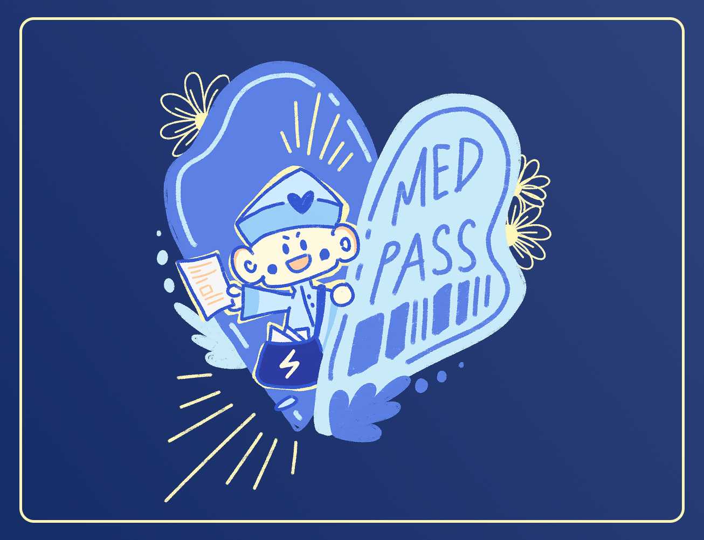

# MedPass - AI-powered EHR Manager 🩺🖥️



## Inspiration

- **Fragmented Medical Records:** Patients’ data is scattered across hospitals, making it hard to get a full picture. MedPass provides a secure mobile EHR “passport.”
- **Emergency Situations:** Doctors lack immediate access to patient history. QR codes + AI summaries deliver critical info instantly.
- **Data Privacy & Ownership:** Patients rarely control their own records. MedPass gives patients ownership and secure sharing.
- **Physician Overload:** Manual record entry takes time from patient care. Voice-to-EHR automation reduces paperwork.
- **Limited Access to Guidance:** Post-discharge patients often struggle to understand care. The AI Doctor chatbot offers 24/7 personalized guidance.

---

## What It Does

MedPass allows patients and doctors to upload PDFs and images, which are analyzed to generate comprehensive EHRs. Features include:

- **Critical Summaries, Visit Histories, Procedures, Surgeries, and Documentation**
- **Voice-to-EHR:** Doctors dictate notes, which are converted into structured records.
- **AI Doctor Chatbot:** Powered by Google MedGemma, LangChain, and LangGraph for specialized guidance.
- **QR Code Feature:** Instantly access a critical summary PDF in emergencies.

---

## Tech Stack

**Frontend:**

- React (client/src)
- Tailwind CSS
- React Router
- React QR Code

**Backend:**

- Node.js (server/index.js)
- Express
- SQLite (users.db)
- JWT, bcrypt, Google OAuth

**AI & Data Pipelines:**

- Python (server/)
- Chainlit (UI for AI Doctor)
- LangChain & LangGraph (AI workflow management)
- Google MedGemma (AI model integration)
- ChromaDB (vector database for RAG)
- Custom pipelines (server/pipelines/)

---

## Folder Structure

```
medpass-ehr-aimanagement/
│
├── client/
│   ├── public/
│   │   ├── chibi.png
│   │   ├── logo.png
│   │   ├── mock_pdf.pdf
│   │   └── side_art.png
│   ├── src/
│   │   ├── components/
│   │   │   └── EHRCardDetail.jsx
│   │   ├── pages/
│   │   │   ├── AIDoctor.jsx
│   │   │   ├── EHR.jsx
│   │   │   ├── Login.jsx
│   │   │   ├── QRCodePage.jsx
│   │   │   └── Sidebar.jsx
│   │   ├── App.jsx
│   │   └── main.jsx
│   ├── package.json
│   └── tailwind.config.js
│
├── server/
│   ├── .chainlit/
│   │   └── config.toml
│   ├── chroma_langchain_db/
│   │   └── chroma.sqlite3
│   ├── pipelines/
│   │   ├── AIdoctorPipeline.py
│   │   └── RAGPipeline.py
│   ├── public/
│   │   ├── custom.css
│   │   └── logo_light.png
│   ├── app.py
│   ├── index.js
│   ├── main.py
│   ├── requirements.txt
│   ├── users.db
│   └── .venv/
│
├── README.md
```

---

## Setup Instructions

### 1. Clone the Repository

```bash
git clone https://github.com/yourusername/medpass-ehr-aimanagement.git
cd medpass-ehr-aimanagement
```

### 2. Frontend Setup

```bash
cd client
npm install
npm run dev
```

- Access the React app at `http://localhost:3000`

### 3. Backend Setup

```bash
cd ../server
npm install
node index.js
```

- Backend runs at `http://localhost:4000`

### 4. AI Doctor (Chainlit) Setup

```bash
cd .venv
Scripts\activate  # On Windows
cd ..
pip install -r requirements.txt
chainlit run main.py
```

- Chainlit UI runs at `http://localhost:8002`

---

## Usage

- **Login/Register:** `/login` page
- **AI Doctor Chatbot:** `/aidoctor` page (iframe or direct)
- **QR Code Generator:** `/qrcode` page (sidebar link)
- **EHR Management:** Upload, analyze, and view medical records

---

## Customization

- **Chainlit UI:** Edit `.chainlit/config.toml` for colors, logo, and branding.
- **AI Workflow:** Modify `pipelines/AIdoctorPipeline.py` and `main.py` for LangChain/LangGraph/MedGemma logic.

---

## Our Journey Highlights

- **Challenges:** Integrating new tech stacks, debugging, rapid learning and sleep-deprived :D

---

## Next Steps of our Product

We aim to scale MedPass beyond EHR management, creating a platform where patients can navigate their healthcare journey seamlessly. MedPass will simplify healthcare documentation and empower patients to better understand and manage their health.

---

## License

MIT License

---

## Credits

- Alex/Tuan Tran: Main project idea, EHR AI integration and voice-to-EHR function
- Han Le: AI Doctor Chatbot implementation and Frontend Design

### This is a HackMIT 2025 Project. Made with luv from Alex Tran and Han Le.
